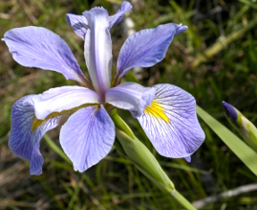
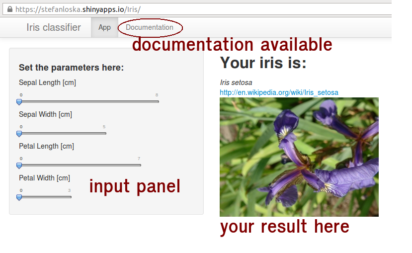

## Intro
These 3 irises look quite similar:

Iris setosa | Iris virginica | Iris versicolor
------------- | ------------- | -------------
  |  | 

* However, they are indeed 3 different species.
* They differ in lengths and widths of petals and sepals.
* Combination of these measurements allows to distinguish them.

---

## Model
To develop a tool for determining the Iris species, a random forest model was built using `iris` data from the `datasets` package.

```{r model, cache=TRUE, echo=c(6:8,10), results='hide', message=FALSE}
library (datasets)
data(iris)
library(caret)
library(randomForest)
set.seed(123)
inTrain=createDataPartition(iris$Species, p=0.75, list=FALSE)
training=iris[inTrain,]
testing=iris[-inTrain,]
set.seed(321)
model = train(Species ~ ., data=training, method="rf")
```

Achieved out of sample accuracy was:

```{r, echo=c(2:3), message=FALSE}
library(caret)
pred = predict(model, newdata=testing)
confusionMatrix(pred, testing$Species)$overall[1]
```

---

## Application

The model was saved as an .RData file and used to build an online application:



---

## Where to find it

The application is available at:

[https://stefanloska.shinyapps.io/Iris/](https://stefanloska.shinyapps.io/Iris/)

Have fun!


